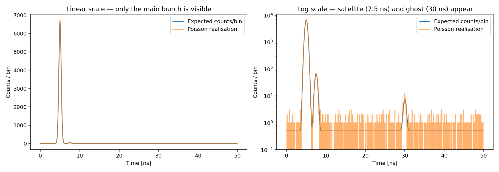
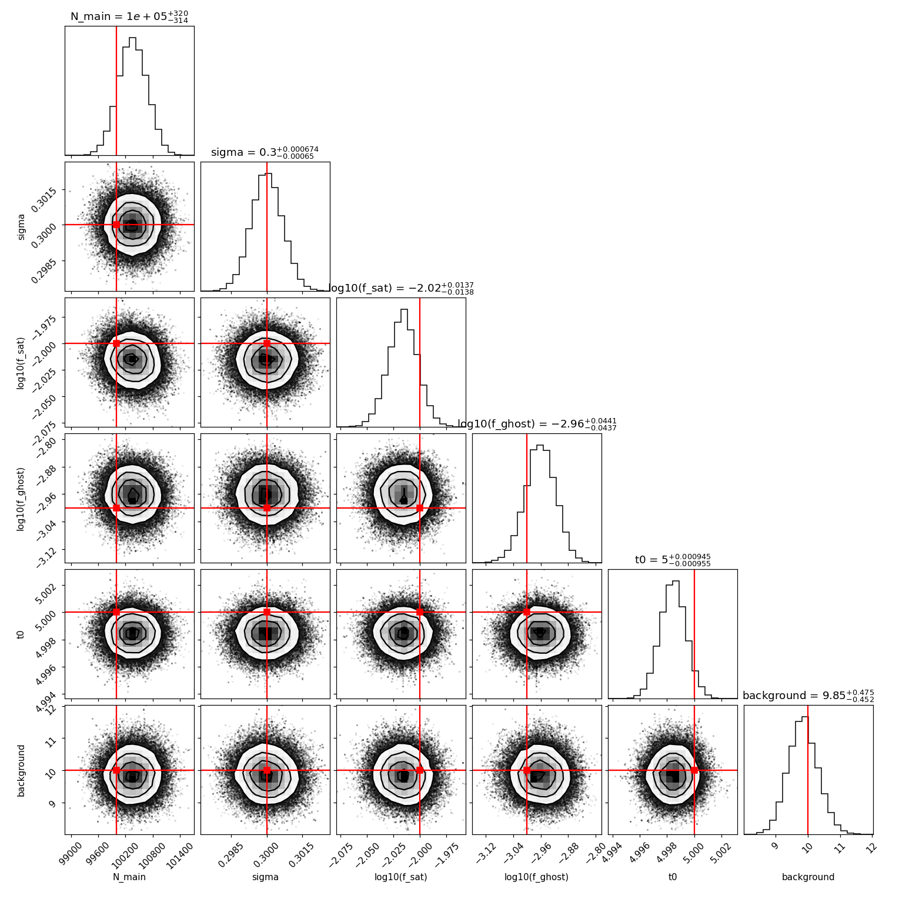
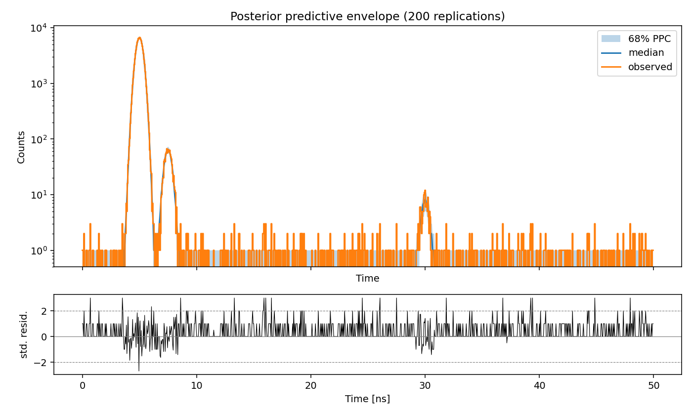

# bsrl-bayesian-bunch-fit

Bayesian reconstruction of a synchrotron longitudinal bunch profile from single-photon-counting data. Recovering satellite and ghost bunch populations 2–3 orders of magnitude below the main peak, with calibrated credible intervals, using MCMC with an exact Poisson likelihood.



*The simulated dataset: photon counts per 0.05 ns bin, shown on a linear scale (left) where only the main bunch is visible, and on a log scale (right) where the satellite at 7.5 ns and the ghost at 30 ns emerge above the dark-count floor.*

---

## Context

A **longitudinal bunch profile** is the time distribution of particles within a single circulating bunch, measured by counting synchrotron-radiation photons in fine time bins. Beyond the main bunch, the same RF structure can trap two parasitic populations:

- **Satellites**: particles captured in an adjacent RF bucket of the same 400 MHz system, a few ns from the main bunch.
- **Ghosts**: particles in nominally empty buckets, tens of ns away.

Both contribute to the beam current used in luminosity calibration, but not to useful collisions; an unmeasured ghost population biases the normalisation. They are faint (here 1% and 0.1% of the main bunch) so the measurement is a **low-count problem sitting on top of a very high-count peak** -> require a Bayesian treatment. In the tails there are 0–3 counts per bin, so a Gaussian (least-squares) error model would allows negative rates. Posterior gives an upper limit.

## Data

Synthetic, generated by this repo (`src/bsrl_fit/simulate_data.py`): a 50 ns window in 0.05 ns bins (1000 bins), ~10⁵ photons in the main bunch, with independent Poisson noise per bin. The right panel above is the same data on a log scale> The satellite at 7.5 ns and the ghost at 30 ns only exist above the dark-count floor of ~0.5 counts/bin.

## Forward model

Expected counts in bin *i* centred at *tᵢ*, with bin width Δt:

```
λ(tᵢ) = Δt · [ N·G(tᵢ; t₀, σ) + N·f_sat·G(tᵢ; t₀+2.5, σ) + N·f_ghost·G(tᵢ; t₀+25, σ) + b ]
kᵢ ~ Poisson(λ(tᵢ))
```

`G` is a unit-normalised Gaussian; all times in ns. Six parameters:

| Parameter | Meaning | Prior |
|---|---|---|
| `N_main` | total photons in main bunch | half-normal, scale 3×10⁵ |
| `sigma` | RMS bunch length [ns] | half-normal, scale 2 ns |
| `f_sat` | satellite fraction | log-uniform, [10⁻⁶, 10⁻¹] |
| `f_ghost` | ghost fraction | log-uniform, [10⁻⁶, 10⁻¹] |
| `t0` | main-bunch centre [ns] | uniform, [0, 50] ns |
| `background` | dark-count rate [ph/ns] | positive, flat |

**Why log-uniform on the fractions.** `f_sat` and `f_ghost` are scale parameters that could plausibly be anywhere from 10⁻⁶ to 10⁻¹. A uniform prior would put 90% of its mass above 10⁻², effectively asserting the satellite is large before seeing any data. Log-uniform is flat *per decade*, which reflect the ignorance on the resulting upper limits. Priors are calibrated and checked with a prior predictive draw in `notebooks/01_fit.ipynb`.

The likelihood is the exact Poisson log-likelihood: `Σ [kᵢ log λᵢ − λᵢ]`

## Inference

**emcee** (Foreman-Mackey et al. 2013): affine-invariant ensemble sampler. It moves a population of "walkers" by stretching each one toward another, so it automatically adapts to correlated or badly scaled parameters without a hand-tuned proposal covariance. Chosen because the problem is low-dimensional (6 parameters), needs no gradients, and the parameters span 6 orders of magnitude in scale.

**Burn-and-restart was necessary**: A naive 5000-step run from a tight 10⁻⁴ ball showed autocorrelation time τ growing with chain length (600 → 2100): a minority of walkers had escaped into the log-uniform prior tails and the stretch move kept dragging the ensemble back and forth. The fix (implemented in `run_mcmc(..., burn_restart=True)`) is a 1000-step exploratory run, re-centre on the highest-log-posterior walker, then restart the production chain with a 10⁻⁵ ball. Result: acceptance 0.52, τ ≈ 65, chain length ≈ 1.4 × 50τ.

Production chain: 32 walkers × 5000 steps = 160 000 draws, stored via `emcee.backends.HDFBackend`.

## Results



*Corner plot of the posterior: diagonal panels are the marginal distribution of each parameter, off-diagonal panels are the pairwise joint distributions (contours at 1σ, 2σ, 3σ), with the injected truth in red> Near-circular contours mean the parameters are essentially uncorrelated.*

| Parameter | Truth | Posterior mean ± sd | 94% HDI | Bias |
|---|---|---|---|---|
| `N_main` | 100 000 | 100 358 ± 317 | [99 771, 100 959] | +1.1σ |
| `sigma` [ns] | 0.300 | 0.30001 ± 0.00067 | [0.2988, 0.3013] | +0.02σ |
| `f_sat` | 0.0100 | 0.00964 ± 0.00031 | [0.0090, 0.0102] | −1.2σ |
| `f_ghost` | 0.00100 | 0.00110 ± 0.00011 | [0.0009, 0.0013] | +0.9σ |
| `t0` [ns] | 5.000 | 4.99845 ± 0.00096 | [4.9966, 5.0003] | −1.6σ |
| `background` [ph/ns] | 10.0 | 9.86 ± 0.47 | [8.99, 10.74] | −0.3σ |

All six truths lie inside the 94% HDI; the largest deviation is 1.6σ on `t0`, consistent with statistical scatter across six parameters.

**Credible upper limits** (95th percentile of the marginal posterior):

- `f_sat` < **1.02 × 10⁻²**  (median 9.6 × 10⁻³, 68% CI [9.3, 9.9] × 10⁻³)
- `f_ghost` < **1.29 × 10⁻³**  (median 1.09 × 10⁻³, 68% CI [0.99, 1.21] × 10⁻³)

`f_ghost` is the least-constrained parameter at ~10% relative precision, coherent since the entire ghost peak contains only ~100 photons. With a low count rate, the posterior gives a bounded, asymmetric statement.

**Convergence.** R̂ = 1.012–1.016 for all parameters, `ess_bulk` ≈ 2 000–2 350, `ess_tail` ≈ 5 800–7 000. Bulk efficiency is ~1.4% of raw draws. Corner contours are close to circular -> no strong degeneracies between the six parameters, which is why the sampler mixes well.

## Validation: posterior predictive check

A **posterior predictive check (PPC)** re-simulates datasets from parameters drawn from the posterior and asks whether the real data looks like a typical member of that set.



*Posterior predictive check: the observed profile (orange) overlaid on the 68% band of 200 datasets re-simulated from the posterior (top), with the standardised residuals below. The data stays inside the band across all four decades of count rate, so the model is consistent with what was measured.*

Top: 200 replicated datasets, 68% envelope, log scale (essential because the satellite and ghost live 2–4 decades below the main peak). Bottom: standardised residuals `(k − median) / √median`,  a real model error shows up as a run of same-sign residuals, not as isolated ±2 excursions.

Two targeted test statistics with **posterior predictive p-values** (the fraction of replications more extreme than the observation; ~0.5 is ideal, near 0 or 1 indicates misfit):

| Statistic | Window | ppp |
|---|---|---|
| T1 — main-peak maximum | t₀ ± 3 ns | 0.40 |
| T2 — ghost-window integral | t₀ + 22 to t₀ + 28 ns | 0.40 |

Both central: the model reproduces both the bright peak and the faint ghost region. No systematic structure in the residuals.

## Repository layout

```
src/bsrl_fit/
  simulate_data.py   forward model + Poisson sampling
  model.py           log_prior / log_likelihood / log_posterior
  sampling.py        run_mcmc with HDF backend and burn-and-restart
  diagnostics.py     traces, corner, ArviZ summary, credible limits
  ppc.py             replications, window statistics, ppp-values, envelope plot
notebooks/
  01_fit.ipynb       data, prior calibration, prior predictive, MCMC run
  02_diagnostics.ipynb  convergence + posterior summary
  03_ppc.ipynb       posterior predictive check
scripts/make_figures.py   regenerates every figure in this README
tests/                pytest suite, run in CI alongside ruff
```

## Reproduce

```bash
git clone https://github.com/lauradmch/bsrl-bayesian-bunch-fit
cd bsrl-bayesian-bunch-fit
uv sync
uv run pytest
uv run jupyter lab notebooks/01_fit.ipynb     # produces results/chain_m3.h5
uv run python scripts/make_figures.py         # regenerates figures/
```

Everything is seeded (`np.random.default_rng`, `run_mcmc(seed=...)`) and the environment is pinned in `uv.lock`, so the numbers above are reproducible bit-for-bit. Chains are not committed (`results/` is gitignored); the notebook regenerates them in ~2 minutes.

## Limitations


- **Simulated data only.** No real detector data with carry calibration drift, background leakage from neighbouring instrumentation channels, and nonlinearities.
- **No dead-time model.** SPAD-type detectors are blind for tens of ns after a detection (paralysable or non-paralysable). Ignoring this biases the peak amplitude and therefore `N_main`.
- **Single bunch, single acquisition.** No turn-by-turn drift, no bunch-to-bunch coupling, no time-dependence of any kind.
- **Fixed peak positions and a shared width.** Satellite and ghost offsets (2.5 ns, 25 ns) and the common σ are hard-coded rather than fitted, which understates the uncertainty on the faint fractions.
- **Gaussian bunch shape.** Real longitudinal profiles are closer to a binomial/q-Gaussian distribution and are asymmetric under non-adiabatic RF manipulations.


## References

- Foreman-Mackey, Hogg, Lang & Goodman 2013, *emcee: The MCMC Hammer*, PASP 125, 306 ([arXiv:1202.3665](https://arxiv.org/abs/1202.3665))
- Gelman, Meng & Stern 1996, *Posterior predictive assessment of model fitness via realized discrepancies*, Statistica Sinica 6, 733
- Vehtari, Gelman, Simpson, Carpenter & Bürkner 2021, *Rank-normalization, folding, and localization: an improved R̂*, Bayesian Analysis 16, 667 ([arXiv:1903.08008](https://arxiv.org/abs/1903.08008))
- CERN Beam Synchrotron Radiation Longitudinal (BSRL) / longitudinal density monitor notes — [CDS](https://cds.cern.ch)

---
*Laura Domenech, 2026.*
